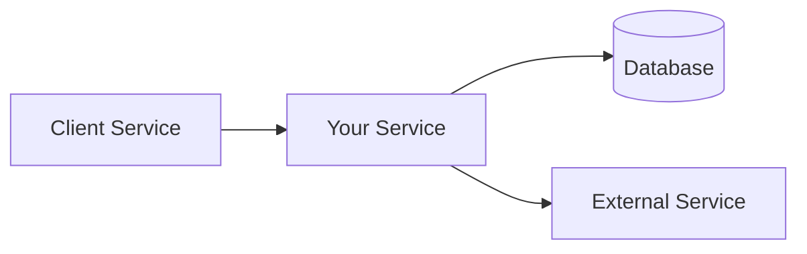
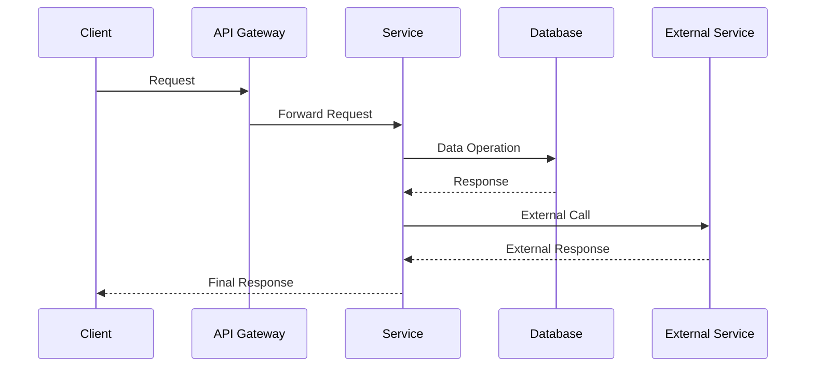
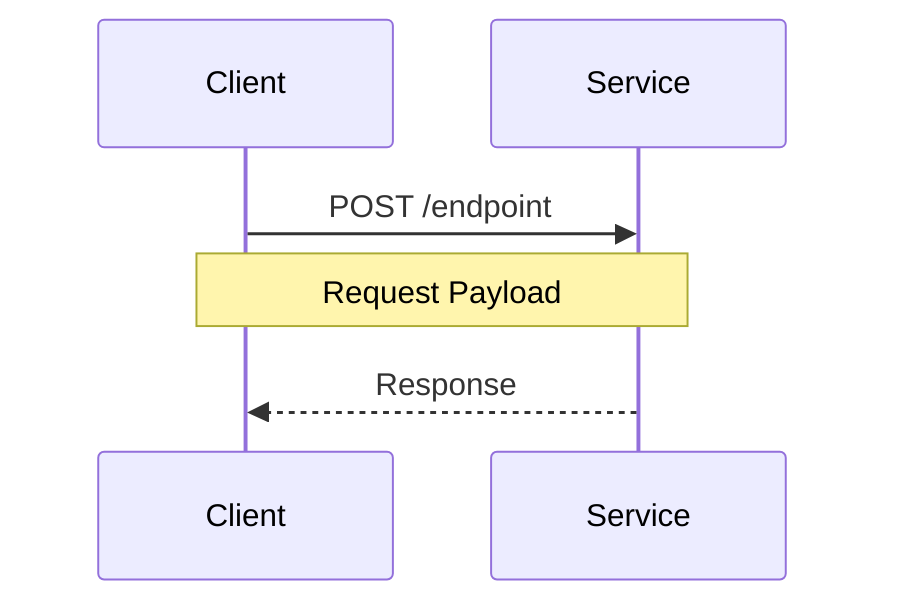
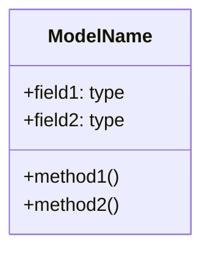
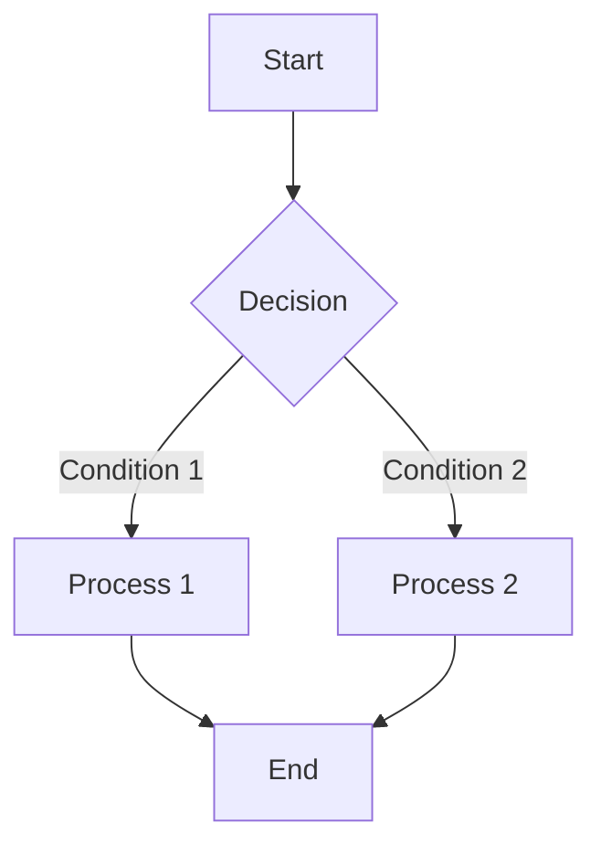
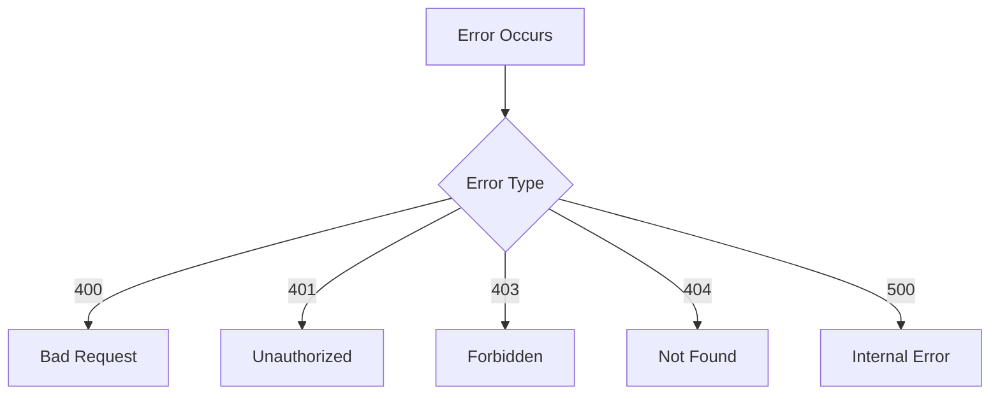

# [Service/Component Name]

## Overview
Brief description of the service/component and its primary purpose.

## System Architecture


## Component Flow


## API Endpoints

### [Endpoint 1]


**Request:**
```json
{
    "field1": "type",
    "field2": "type"
}
```

**Response:**
```json
{
    "field1": "type",
    "field2": "type"
}
```

### [Endpoint 2]
[Similar structure to Endpoint 1]

## Data Models

### [Model 1]


## Processing Workflow


## Dependencies

### External Services
- Service 1: Description
- Service 2: Description

### Internal Components
- Component 1: Description
- Component 2: Description

## Configuration

### Environment Variables
```properties
VARIABLE_1=description
VARIABLE_2=description
```

## Error Handling

### Error Codes


## Monitoring and Logging

### Metrics
- Metric 1: Description
- Metric 2: Description

### Log Format
```json
{
    "timestamp": "ISO-8601",
    "level": "INFO|ERROR|WARN",
    "service": "service-name",
    "message": "log message"
}
```

## Security Considerations
- Security Point 1
- Security Point 2

## Performance Considerations
- Performance Point 1
- Performance Point 2


## Version History
| Version | Date | Description |
|---------|------|-------------|
| 1.0.0   | DATE | Initial Release |
