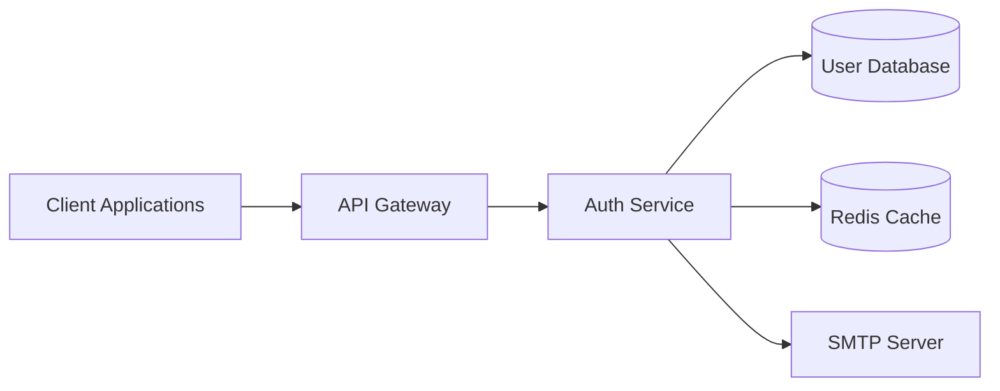
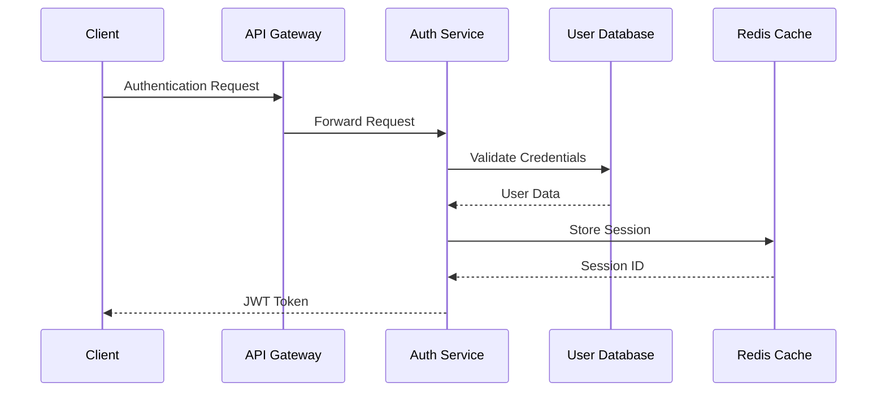
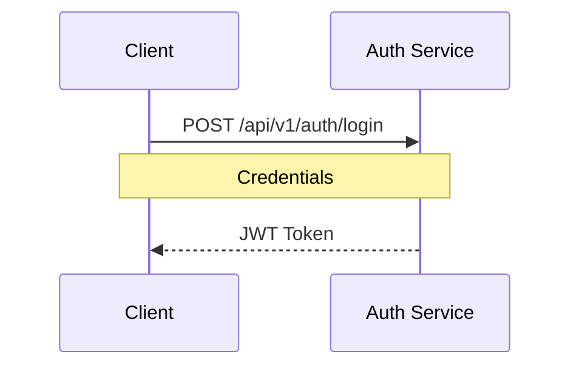
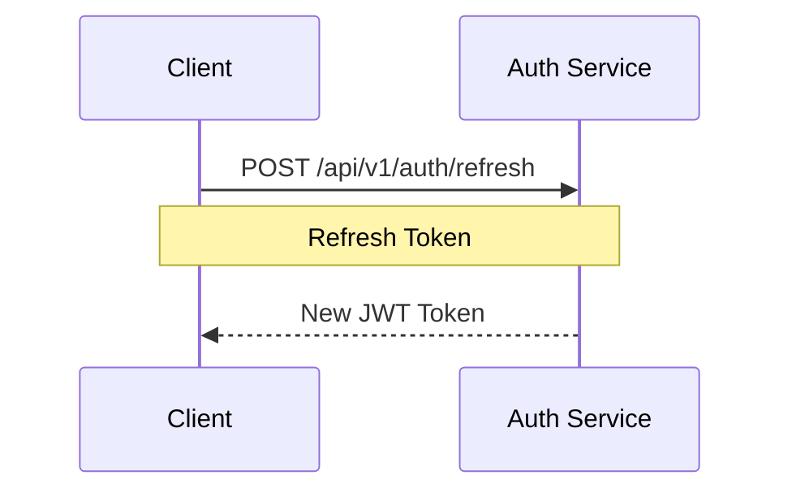
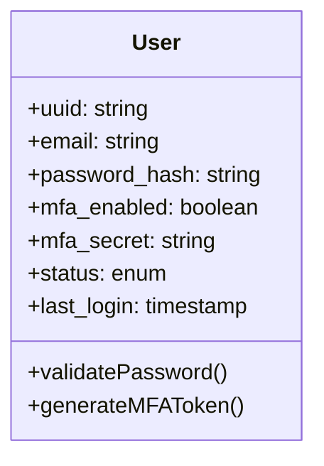
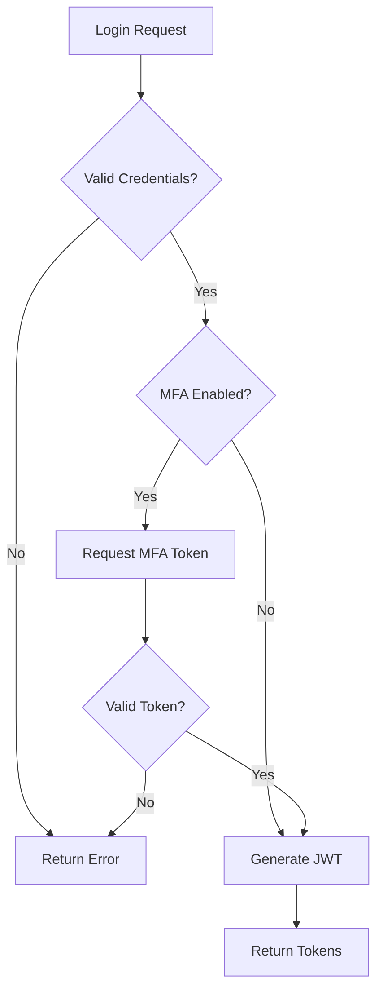
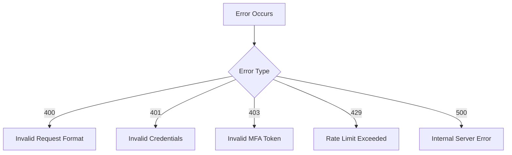

# User Authentication Service

## Overview
The User Authentication Service is a centralized authentication and authorization system that provides secure user authentication, session management, and access control for all internal applications. It implements OAuth 2.0 and OpenID Connect protocols to provide standardized authentication flows.

## System Architecture


## Component Flow


## API Endpoints

### Login


**Request:**
```json
{
    "email": "string",
    "password": "string",
    "mfa_token": "string (optional)"
}
```

**Response:**
```json
{
    "access_token": "string",
    "refresh_token": "string",
    "token_type": "Bearer",
    "expires_in": 3600
}
```

### Refresh Token


**Request:**
```json
{
    "refresh_token": "string"
}
```

**Response:**
```json
{
    "access_token": "string",
    "refresh_token": "string",
    "token_type": "Bearer",
    "expires_in": 3600
}
```

## Data Models

### User Model


## Processing Workflow


## Dependencies

### External Services
- SMTP Server: For sending password reset and MFA emails
- Redis: For session management and rate limiting
- Monitoring Service: For system metrics and alerts

### Internal Components
- User Database: PostgreSQL database for user data
- Config Service: For managing environment-specific configurations
- Logging Service: For centralized logging

## Configuration

### Environment Variables
```properties
AUTH_JWT_SECRET=JWT signing secret key
AUTH_JWT_EXPIRY=3600
AUTH_REDIS_URL=redis connection string
AUTH_DB_URL=database connection string
AUTH_SMTP_HOST=smtp server hostname
AUTH_SMTP_PORT=smtp server port
AUTH_SMTP_USER=smtp username
AUTH_SMTP_PASS=smtp password
```

## Error Handling

### Error Codes


## Monitoring and Logging

### Metrics
- Login attempts (success/failure)
- Token refresh rate
- MFA usage statistics
- API response times
- Error rates by type

## Security Considerations
- All passwords are hashed using bcrypt with appropriate salt rounds
- JWT tokens are signed with RS256 algorithm
- Rate limiting is implemented on all endpoints
- Failed login attempts are tracked and temporary blocks are implemented
- All sensitive data is encrypted at rest
- TLS 1.3 is required for all communications

## Performance Considerations
- Redis caching for frequently accessed user data
- Database connection pooling
- Horizontal scaling capability
- Rate limiting to prevent abuse
- Efficient token validation without database hits


## Version History
| Version | Date | Description |
|---------|------|-------------|
| 1.0.0 | 2025-02-11 | Initial Release |
| 1.1.0 | 2025-02-12 | Added MFA Support |

