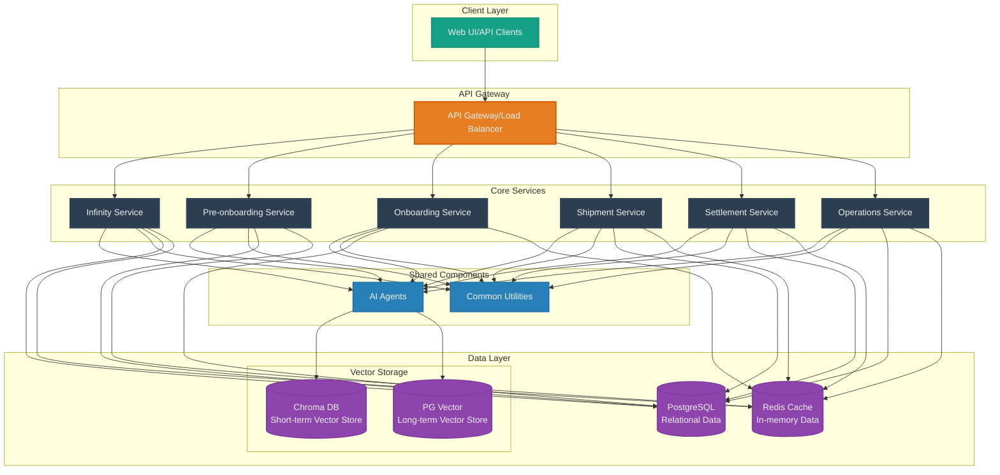

# Architecture

## System Overview
Orchestro Intelligence is built on a microservices architecture, designed for scalability, maintainability, and high performance. The system incorporates both traditional data stores and modern vector databases to support AI operations and business logic.

## Component Diagram

## Component Details

### Client Layer
- **Web UI/API Clients**
  - External applications accessing services
  - REST API consumers
  - Web interface users
  - Mobile application clients

### API Gateway
- **Gateway/Load Balancer**
  - Route management
  - Load balancing
  - Request/Response transformation
  - Authentication/Authorization
  - Rate limiting
  - API versioning

### Core Services

#### Infinity Service
- Content management system
- Corporate site management
- Knowledge base operations
- Tool management interface

#### Pre-onboarding Service
- Pre-sales workflow management
- PLD (Pre-Loading Data) handling
- Verification processes
- Initial customer engagement

#### Onboarding Service
- Member registration and management
- Account setup and configuration
- Network management
- Access control

#### Shipment Service
- Quote calculation
- Service options management
- Order processing
- Shipment tracking
- Route optimization

#### Settlement Service
- Invoice generation
- Billing management
- Tax calculations
- Financial reporting

#### Operations Service
- Data analytics
- Feedback management
- Report generation
- Performance monitoring

### Shared Components

#### AI Agents
- Base agent framework
- Service-specific agents
- Vector embedding operations
- Context management
- Memory handling (short-term/long-term)

#### Common Utilities
- Configuration management
- Database connections
- Shared utilities
- Common middleware
- Logging and monitoring

### Data Layer

#### Vector Storage

##### Chroma DB (Short-term Vector Store)
- Real-time vector embeddings
- Quick retrieval for AI operations
- Temporary vector storage
- Optimized for rapid access
- Context-aware operations

##### PostgreSQL with pgvector (Long-term Vector Store)
- Persistent vector embeddings
- Historical data analysis
- Large-scale vector operations
- Integration with relational data
- Long-term memory storage

#### Traditional Storage

##### PostgreSQL (Relational Data)
- Structured business data
- Transactional operations
- Service-specific schemas
- Data relationships
- ACID compliance

##### Redis Cache (In-memory Data)
- Session management
- Real-time operations
- Temporary data storage
- Performance optimization
- Quick lookup operations

## Data Flow Patterns

### AI Operations Flow
1. Client request reaches service through API Gateway
2. Service invokes appropriate AI Agent
3. Agent checks Chroma DB for recent context
4. If needed, retrieves historical data from PG Vector
5. Processes request with combined context
6. Stores new embeddings in appropriate vector store
7. Returns processed result to client

### Transaction Flow
1. Client initiates transaction
2. API Gateway routes to appropriate service
3. Service validates request
4. Processes business logic
5. Stores data in PostgreSQL
6. Updates cache if necessary
7. Returns response to client

## Security Considerations
- API Gateway handles authentication/authorization
- Service-to-service communication is secured
- Data encryption at rest and in transit
- Regular security audits
- Compliance with data protection regulations

## Monitoring and Logging
- Centralized logging system
- Performance monitoring
- Error tracking
- System health checks
- Resource utilization monitoring

## Deployment Considerations
- Container orchestration with Kubernetes
- Service mesh for communication
- Auto-scaling capabilities
- High availability setup
- Disaster recovery planning
